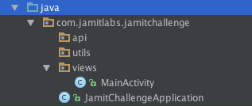
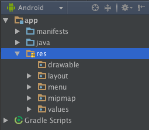

In diesem Artikel wird ein sinnvoller Aufbau für ein Android Studio Projekt dargestellt. Dabei geht es um den von Android vorgebenen Aufbau der `res` - Dateien und ein Beispiel für die frei wählbare Struktur der `java` - Dateien.

## Anlegen der `java`- Dateien

Beim Aufbau und Benennung der `java`- Dateien ist man prinzipiell frei. Es lohnt sich jedoch eine übersichtliche Struktur anzulegen und einzelne Belange zu trennen. Besonders hilfreich ist eine übersichtliche Struktur bei der Zusammenarbeit mit anderen, da sie jedem der projektfremd ist, vereinfacht einen schnellen Überblick zu bekommen. Auch bei Fehlerbehebungen und Modul Erweiterungen ist es wichtig, dass die Zusammenhänge gleich erkannt werden und so die Entwicklungszeit insgesamt gesenkt werden kann. Insbesondere steigert eine übersichtlichte Struktur besonders die Wartbarkeit und auf lange Sicht die Code Qualität.

Strukturbeispiel:



* **api**: In dem Api Package könnten alle Dateien abegelgt werden, die dazu  benötigt werden mit Hardware zu kommunzieren.
* **utils**: In dem Utils Package könnten alle Dateien abgelegt werden, die sich generell für die ganze App als nützlich erweisen, wie zum Beispiel Helper Klassen.
* **views**: In das Views Package kommen alle Dateien, die mit dem Aufbau des Layouts zu tun haben (Activities, Fragmente, Dialoge). Innerhalb dieses Packages kann weiter gegliedert werden zum Beispiel nach Teilbereichen der App, sodass zusammengehörige Klassen auch an einem Ort aufzufinden sind.


## Anlegen der `res`(Ressourcen) - Ordner

Im Ressourcen - Verzeichniss werden Inhalte wie zum Beispiel Texte, Bilder, Menüs, Layouts oder Animationen in XML Dateien angelegt ohne eine Zeile Java-Code zu schreiben. Man könnte dies alles auch programmatisch lösen, jedoch ermöglicht die Plazierung außerhalb des Codes ungeschultem Personal die Daten unabhängig davon bearbeiten zu können. Beispiel dafür wären Übersetzungen einzupflegen oder das Branding durch die styles.xml / colors.xml zu ändern. Außerdem dient der Aufbau der Resourcen der Übersichtlichkeit.



In diesem Beispiel kann man die Unterverzeichnisse sehen, die für ein Projekt benötigt werden. Die Struktur der Verzeichnisse ist von Android vorgegeben. Innerhalb des `res` -Ordners dürfen sich nur Unterverzeichnisse befinden und keine Dateien. Auch die Benennung der Unterverzeichnisse ist fest vorgegeben, da Android sich zur Laufzeit genau die Dateien aus den Ordnern heraus greift, welche am Besten zu den Eigenschaften des jeweiligen Gerätes passen.

Im Folgenden eine Auflistung der Default Ressourcen.

 * animator
 * anim
 * color
 * drawable
 * mipmap
 * layout
 * menu
 * raw
 * values
 * xml

*Auf den Inhalt der einzelnen Ordner wird später eingegangen.*

### Spezialisierungen

Zusätzlich zu den Default Ressourcen gibt es Spezialisierungen, welche auf genauere Geräteeigenschaften eingehen. Zum Beispiel könnte man veschiedene Layouts für verschiedene Screengrößen anlegen oder man möchte, dass ein anderes Layout verwendet wird, wenn der Benutzer der App in den Landscape Modus wechselt. Für diese Spezialisierungen müssen neue Verzeichnisse im `res` -Ordner angelegt werden.


Folgende Regeln sind dabei zu Beachten:

* **Die Verzeichnisse dürfen nicht geschachtelt werden**

  Richtig:

  ```
   res/
      drawable/
      drawable-hdpi/
      layout/
  ```
  Falsch:  

  ```
  res/
     drawable/
         drawable-hdpi/
     layout/
  ```


* **Die Benennung folgt diesem Schema**

  ```
  <resources_name>-<qualifier>
  ```
  * **resources_name** ist der Name der Default - Ressource auf die sich die Spezialisierungen bezieht.
  * **qualifier** ist der Name der Spezialisierung für welche die Ressource benutzt werden soll.


* **Beim Anlegen der Verzeichnisse muss eine bestimmte Reihenfolge eingehalten werden**

  Da Android sich die zu den Geräteeigenschaften passenden Dateien heraussucht, würden manche Dateien bei falscher Anordnung ignoriert werden.

  Richtig:

  ```
  res/
      layout/
      layout-port/
      layout-land/
  ```
  Falsch:

  ```
  res/
      layout-port/
      layout/
      layout-land/
  ```
* **Beim Anhängen von mehreren Spezialisierungen muss eine bestimmte Reihenfolge eingehalten werden.**

 Auf [dieser Seite](http://developer.android.com/guide/topics/resources/providing-resources.html)
 in Tabelle 2 sind die Reihenfolge der Verzeichnisse und aller möglichen Spezialisierungen angegeben.

* **Ein Verzeichnis kann nur eine Spezialisierung eines Typs bekommen**

  Richtig:

  ```
  drawable-rES/
  drawable-rFR/
  ```

  Falsch:

  ```
  drawable-rES-rFR/
  ```

  Möchte man jedoch die gleiche Datei in beiden Ordnern ablegen, kann sie auch außerhalb definiert werden.


Android sucht nach der am Besten zu den Geräteeigenschaften passenden Spezialisierung. Falls keine passende gefunden werden kann, wird auf die Default Werte zugegriffen, die sich in den Default Ordnern ohne Spezialisierung befinden (`layout/`, `values/`). Es ist wichtig Default Ressourcen anzubieten, sonst stürzt die App ab. Genauso ist es wichtig, dass die Dateien in allen Spezialisierungen, sowie dem Default Ordner, gleich benannt sind, da die Ressourcen im Code durch IDs angesprochen werden.


### Unterschied von Animationen im `animator` - Verzeichnis und im `anim `- Verzeichniss

In das Verzeichnis `anim` gehören **tween animations**.


Bei diesen handelt es sich um die **Standard Animationen** und kann nur auf Views angewendet werden. Möglich ist dabei nur die Veränderung der Position (translation), die Veränderung der Größe (scale), der Rotation (rotation) und der Durchsichtigkeit (alpha) der View. Die Implementierung und der Aufbau ist relativ einfach. Bei der Animation wird jedoch nicht das tatsächliche Objekt angepasst, sondern nur der Aubau der View. Das kann zum Problem werden, wenn die View klickbar sein soll, da der klickbare Bereich während der Animation nicht aktualisiert wird.

Diese Animation gibt es seit API Level 1.

Weitere Informationen: [Android View Animations](http://developer.android.com/guide/topics/graphics/view-animation.html#tween-animation)


In das Verzeichnis `animator` gehören **property animations**.


Bei diesen Animationen werden die Eigenschaften eines Objects über einen bestimmten Zeitraum verändert. In diesem Fall werden die Objekte direkt modifiziert und auch der klickbare Bereich würde am Objekt haften, da die Eigenschaften des Zielobjects in Echtzeit aktualisiert werden. Diese Art von Animation kann für alle Arten von Objekten verwendet werden, nicht nur für Views, und sind insgesamt generischer und flexibler.

Diese Animation wurde bei API Level 11 hinzugefügt.

Weitere Informationen: [Android Property Animation](http://developer.android.com/guide/topics/graphics/prop-animation.html)

### Verzeichnis `color`

Im Verzeichnis ***color*** werden xml-Dateien angelegt, die eine **Color State List** beinhalten. Diese ist ein Objekt, welches man wie eine **color** verwenden kann. Hier kann man eine Liste von verschiedenen Farben für verschiedene Zustände definieren, wie zum Beispiel *gedrückt*, *im Fokus*, *normal*. Wird diese Liste benutzt, werden diese Farben je nach Zustand eingesetzt.

Weitere Informationen: [Color State List Resource](http://developer.android.com/guide/topics/resources/color-list-resource.html)


### Verzeichnis `drawable`

Im Verzeichnis ***drawable*** werden verschiedene Arten von Graphiken abgelegt.

Weitere Informationen im Artikel: [0250 Drawable Ressourcen]()


### Verzeichnis `mipmap`

Im Verzeichnis *mipmap* werden die Laucher Icons (App Icons) abgelegt, welche auf dem Homescreen angezeigt werden. Da es viele unterschiedliche Geräte mit unterschiedlichen Auflösungen gibt, sollten auch diese Icons in unterschiedlichen Pixeldichten abgelegt werden. Der Unterschied zu den Icons im Drawable Ordner ist, dass die Icons nicht nach der Auflösung des Gerätes ausgewählt werden, sondern auch Icons mit einer höheren Auflösungen benutzt werden, um sie größer darzustellen.


### Verzeichnis `layout`

Im Verzeichnis *layout* wird das Aussehen der Benutzeroberflächen festgelegt. Es gibt zwei Möglichkeiten ein Layout zu definieren:

* **In XML Dateien**
* **Zur Laufzeit**

Man kann jede Variante für sich oder beide zusammen verwenden. Zu empfehlen ist, das Grundlayout in den XML Dateien zu definieren. Diese können von Android Studio visuell dargestellt werden und erleichtern das Erstellen und Bearbeiten. Auch ist der Aufbau der Oberfläche klar von der Funktionsweise getrennt. Späteres modifizieren ist somit einfacher und es besteht die Möglichkeit Layouts für unterschiedliche Screengrößen oder Ausrichtungen anzupassen. Zur Laufzeit sollten dann Veränderungen der, in den XML Dateien definerten, Layouts erfolgen und Custom Views erstellt werden.


### Verzeichnis `menu`

Im Verzeichnis *menu* werden die Optionsmenüs, Kontextmenüs und Untermenüs angelegt.

### Verzeichnis `raw`

Im Verzeichnis *raw* werden Dateien in ihrem `.raw` - Format abgelegt. Dies ist sinnvoll bei Videos oder Audios, da es hier auf eine gute Qualität der Wiedergabe ankommt. Die Inhalte dieses Ordners werden bei der APK Erstellung nicht komprimiert, da sie sonst nicht mehr abspielbar wären.

### Verzeichnis `values`

Im Verzeichnis *values* werden Dateien angelegt, welche einen einfachen Wert besitzen, wie zum Beispiel Strings, Integers oder Farben. Diese Dateien enthalten nicht nur eine Ressouce, wie die anderen XML Dateien in den anderen Verzeichnissen, sondern können beliebig viele Ressourcen enthalten. Die Festlegung von Farben, Strings oder Dimensionen in diesen Dateien ist sinnvoll, da sie so unabhängig vom Code geändert werden können. Möchte man zum Beispiel eine Accent Farbe in einer App benutzen und diese wird fünfzig mal verwendet, so muss man sie, falls man sich für eine andere Farbe entscheidet, nicht fünzig mal ändern, sondern nur ein einziges Mal in der colors.xml.

Des Weiteren ist wichtig, dass Texte, Audios, Graphiken, etc. auf die Regionen angepasst werden, in der die App benutzt wird. Dazu sind mehrere values Ordner anzulegen, die jeweils die regionsspezifischen Inhalte enthalten. Der `values`- Ordner ist dabei der Default Ordner und sollte die Region beinhalten, die die meisten Benutzer benutzen werden.

```
values/
  strings.xml
values-en/
  strings.xml
values-fr/
  strings.xml
```

Die Bennenug der Dateien folgt diesen Namenskonventionen:

#### arrays.xml

Ein **Array** definiert ein Array aus Strings

```
<string-array name="string_array_name">
    <item>Erstes Wort</item>
    <item>Zweites Wort</item>
    <item>Drittes Wort</item>
</string-array>
```

#### attrs.xml

In der attrs.xml können **Attribute** für eigene View Klassen erzeugt werden. Neben den Standardattributen wie zum Beispiel layout_height, background, etc. können so neue, individuelle Attribute angelegt werden.


```
<declare-styleable name="Beispiel"
  <attr name="showText" format="boolean" />
  <attr name="content" format="string" />
  <attr name="position" format="enum" >
    <enum name="left" value="0" />
    <enum name="right" value="1" />
  </attr>
</declare-styleable>
```
Der Name (hier *Beispiel*) sollte nach Convention gleich benannt werden wie die Klasse in der die View erzeugt wird.

In der layout.xml können diese Attribute benutzt werden.


#### colors.xml

Ein **Color** Wert definiert eine Farbe und besteht aus einem RGB Wert und einem Alphakanal. Die Color-Ressource kann überall dort verwendet werden, wo ein hexadezimal Wert akzeptiert wird. Diese Format Möglichkeiten gibt es: #RGB, #ARGB, #RRGGBB, #AARRGGBB

```
<color name="color_name">#000000</color>
```

#### dimens.xml

Ein **Dimen** Wert definiert eine Dimension und besteht aus einer Nummer und einer Einheit. Benutz werden können Dimen-Werte zum Beispiel für verschiedene Abstände in Layouts oder Textgrößen.

Die folgenden Einheiten werden akzeptiert:

* **dp** (Density-independent Pixels) sind eine abstrakte Einheit, die auf der Pixeldichte des Screens beruht. Auf einem 160 dpi screen ist 1 dp ungefähr gleich 1px. Ist die Pixeldichte höher oder niedriger wird die Anzahl der Pixel, die einem dp entsprechen, im Verhältnis angepasst.

* **sp** (Scale-independent Pixel) funktionieren gleich wie *dp*, kann jedoch aber durch die Schriftgrößen Präferenzen des Benutzers angepasst werden. Daher ist es sinnvoll diese Einheit für Schriftgrößen einzusetzten.

* **pt** (Points) 1/72 of an inch, basierend auf der physikalischen Größe des Screens.

* **px** (Pixel) ist relativ zu den Pixeln eines Screen. Dies ist nicht zu empfehlen, da jedes Gerät eine andere Auflösung hat und die Darstellung somit sehr kompliziert wird.

* **mm** (Milimeter) ist relativ zur physikalischen Größe des Screens.
* **in** (Inches) ist relativ zru physikalischen Größe des Screens.

```
<dimen name="dimen_name">12sp</dimen>
```

#### strings.xml

Ein **String** Wert defininert ein Wort oder einen Text. Texte sollten, nicht direkt im Code gesetzt werden. Sie sollten einfach geändert und in andere Sprachen übersetzt werden können. Dazu werden sie in der strings.xml defniniert und diese Datei kann dann je nach Sprache ohne viel Aufwand ausgetauscht werden.

```
<string name="string_name">Hallo Welt!</string>
```

#### styles.xml

Ein **Style** Wert definiert das Format und das Aussehen für eine View oder eine komplette Activity oder Applikation. Dort können mehrere Eigenschaften gesammelt werde, wie zum Beispiel height, padding, font color, font size, background, color, etc.

So kann man zum Beispiel das Layout vom Inhalt trennen:

```
<TextView
  android:layout_width="fill_parent"
  android:layout_height="wrap_content"
  android:textColor="#00FF00"
  android:typeface="monospace"
  *android:text="@string/hello"* />


<TextView
  style="@style/Text"
  android:text="@string/hello" />

```

Neben den Styles kann man auch **Themes** anlegen. Diese sind Styles, die auf komplette Activites oder Applikationen angewandt werden können.

Weitere Informationen: [Styles and Themes](http://developer.android.com/guide/topics/ui/themes.html)

### Verzeichnis `xml`

Im Verzeichniss *xml* werden beliebige XML Dateien abgelegt.

```
<?xml version="1.0" encoding="utf-8"?>
<rootelement>
  <subelemnt>Element 1</subelement>
  <subelement>Element 2
    <subsubelement>Element 3</subsubelement>
  </subelement>
</rootelement>
```
Möchte man zum Beispiel Daten aus einem hier abgelegten xml Dokument auslesen, gibt es Schnittstellen wie den XmlResourceParser, die das ermöglichen.
