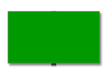
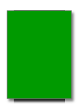
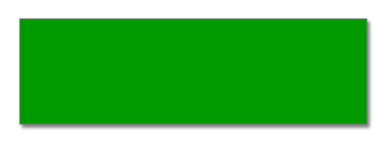
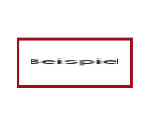

Im Verzeichnis ***drawable*** werden verschiedene Arten von Graphiken abgelegt.

* **Bitmap File:** Graphik Datei (.png, .jpg, .gif)
* **Nine-Patch File:** .png Datei, die strechbare Regionen besitzt, welche es möglich
machen, dass das Bild je nach Inhalt an die Größe angepasst werden kann.
* **Layer List:** Array aus anderen Drawables.
* **State List:** XML Datei, welche verschiedene Graphiken für verschiedene Zustände defininert.
* **Level List:** XML Datei, welche ein Drawable definiert, welches eine Anzahl von Ersatz Drawables managed.
* **Transition Drawable:** XML Datei, welche ein Drawable, das zwischen zwei Drawables faden kann, defininert.
* **Inset Drawable:** XML Datei, welche ein Drawable, das ein anderes Drawable mit einem bestimmten Abstand einsetzt, definiert.
* **Clip Drawable:** XML Datei, welche ein Drawable, das die ein anderes Drawables abschneidet, definiert.
* **Scale Drawable:** XML Datei, welche ein Drawable, das die Größe eines anderen Drawables verändert, definiert.
* **Shape Drawable:** XML Datei, welche eine geometrische Figur mit Farben und Verläufen definiert.

> Wichtig! Direkt im Drawables Verzeichniss sind nur XML files abzulegen. Bilder und Icons sollten sich in auflösungsspezifischen Ordnern befinden. So ist es übersichtlicher und einfacher zu warten.

### Bilder für unterschiedliche Pixeldichten anlegen

Da Android auf vielen unterschiedlichen Geräten mit verschiedenen Pixeldichten läuft, ist es wichtig, dass die Auflösung von Bildern oder Icons auf diese Größe abgestimmt ist. Nur so kann man eine positive Nutzererfahrung garantieren.

Android skaliert UI Layouts und Ressourcen zur Laufzeit, um die verschiedenen Displays zu unterstützen. Dabei kategorisiert Android basierend auf der Displaygröße und Displaydichte.

* Wenn man **keine** zu den Größen und Dichten passende Ressourcen zur Verfügung stellt, skaliert Android entweder die Default Ressourcen (`drawable/`) oder aber auch andere dichtespezifischen Ressourcen, um die besten Ergebnisse zu erzielen. Wird zum Beispiel nach einer *low-density - Ressource* gesucht und diese ist nicht verfügbar, dann skaliert das System zum Beispiel eine *high-density - Ressource* herunter.
Man sollte sich **NICHT** auf das Skalieren von Android verlassen, da die Bilder oft verzerrt, grisselig oder ausgefranst werden.

* Liefert man jedoch auf die Auflösungen abgestimmte Ressourcen, dann lädt Android diese ohne sie zu skalieren.
(Vorrausgesetzt es ist kein android:scaleType im ImageView definiert.)

*Beispiel für ein dichtespezifisches Icon*

Es gibt sechs allgmeine Pixeldichten. Sind Bilder oder Icons in unterschiedlichen Dichten angelegt, entscheidet Android je nach Eigenschaften des Gerätes welches Bild oder Icon mit welcher Dichte angezeigt werden soll.

* ldpi (low) ~120dpi
* mdpi (medium) ~160dpi
* hdpi (high) ~240dpi
* xhdpi (extra-high) ~320dpi
* xxhdpi (extra-extra-high) ~480dpi
* xxxhdpi (extra-extra-extra-high) ~640dpi

Damit Android das richtige Bild auswählen kann, muss die vorgegebene Ordnerstruktur stimmen. Zusätzlich zu dem Default Drawable Ordner müssen sich mindestens drei weitere Ordner in dem `res`-Verzeichnis befinden. Die Bennenung ist wie folgt: `drawable-hdpi, drawable-mdpi, drawable-xhdpi, ... `.

Die verschiedenen Auflösungen berechnen sich wie folgt, basierend auf der **medium density (mdpi)** :

* ldpi (0,75x)
* mdpi (1,0x baseline)
* hdpiv (1,5x)
* xhdpi (2,0x)
* xxhdpi (3,0x)
* xxxhdpi (4,0x)

Man kann sich die Bilder in verschiedenen Auflösungen auch auf [dieser Seite](https://romannurik.github.io/AndroidAssetStudio/icons-generic.html#source.space.trim=1&source.space.pad=0&size=99&padding=0&color=33b5e5%2C0&name=ic_dsc_6895) berechnen lassen. Nach dem Auswählen eines Bildes oder Icons, können noch weitere Einstellungen getroffen werden, wie zum Beispiel Anpassungen der Größe oder des Paddings. Hier kann man sich auch die generierten Dateien herunterladen. Diese befinden sich in der oben beschriebenen Ordnerstruktur, müssen jedoch in das Android Studio Projekt kopiert wer
Möchte man Bilder oder Icons einsetzten, die nur in einer Auflösung vorkommen sollen, werden diese im Ordner `drawable-nodpi` abgelegt.

Weitere Informationen: [Supporting Multiple Screens](http://developer.android.com/guide/practices/screens_support.html#xxxhdpi-note)

### Vectorgrafiken

Es gibt auch die Möglichkeit Vectorgrafiken als Ressourcen in Android Studio anzulegen. Diese machen vor allem bei einfachen Icons Sinn. Auch können sie die Größe der App reduzieren, da nicht Bilder in mehreren Auflösungen angelegt werden müssen, sondern nur eine Datei, die sich der Auflösung entsprechend berechnet.

Um Vektorgrafiken zu erzeugen gibt es ein Tool in Android Studio, das [Vector Asset Studio](http://developer.android.com/tools/help/vector-asset-studio.html).

Vectorgrafiken werden erst ab API Level 21 unterstützt. Alternativen für niedrigere Level sind einmal die Support Library zu benutzten oder die Icons als Rastergrafiken von Vector Asset Studio generieren zu lassen.

### Nine-Patch Files

Ein Nine-Patch ist eine PNG Bild, welches sich je nach Größe des zur Verfügung stehenden Platzes anpasst. Ein Beispiel wäre eine Box mit Schatten. Dabei soll sich die Größe der Box verändern können, der Schatten jedoch sollte nicht verzogen werden. Bilder die sich sich für Nine Patch Dateien eignen, sollten aus streckbaren Flächen bestehen.

*Beispiel für eine Nine-Patch Datei*

Ändert sich nun der Platz, der dem Bild zur Verfügung steht, so wird die Datei diesem angepasst. Der grüne Inhalt wird vergrößert oder verkleinert, der Schatten verändert sich jedoch nicht.

*Schlechtes Beispiel Nine Patch Datei*

*Schlechtes Beispiel Nine Patch Datei*

Nicht geeignet für Nine-Patch Dateien sind Photos oder Bilder mit Texten, da diese nicht streckbar sind und verzogen werden.

Um Nine-Patch PNGs zu erzeugen ist [diese Seite](https://romannurik.github.io/AndroidAssetStudio/nine-patches.html) zu empfehlen. Hier kann man in der *Interactive Preview* testen wie sich die Datei bei Veränderung der Größe verhält. Außerdem bietet sie die Möglichkeit, die Dateien direkt herunterzuladen. Auch diese Dateien sollten in verschiedenen Auflösungen integriert werden.

Zu erkennen sind Nine-Patch Dateien an der Endung: `.9.png`.

Weitere Informationen: [Nine-Patch](http://developer.android.com/guide/topics/resources/drawable-resource.html#NinePatch)
