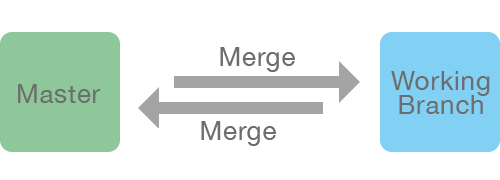
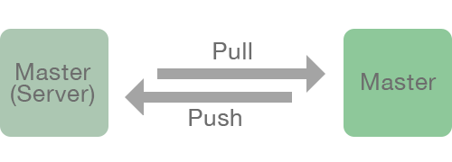

In diesem Artikel wird beschrieben, was Versionsverwaltungssysteme sind, welche Probleme sie lösen und welchen Begriffe man bei der täglichen Arbeit mit ihnen begegnen wird mitsamt ihrer Bedeutung.

## Eine Welt ohne Versionsverwaltung

Angenommen ein Projekt wird ohne Versionsverwaltung umgesetzt und es gibt einen Fehler. Zur Behebung des Fehlers werden Änderungen am Code des Projekts durchgeführt und dabei wie so oft verschiedene Ansätze ausprobiert, bis der richtige Fix gefunden ist. Dabei kommt es vor, dass man nach mehreren Anläufen feststellt, dass irgendetwas anderes nicht mehr funktioniert als das, was man eigentlich beheben möchte, weil vor dem Beginn eines neuen Ansatzes ein vorheriger Ansatz nicht komplett rückgängig gemacht worden ist. Es wurde also irgendetwas vergessen, was jetzt Auswirkungen auf den neuen Ansatz hat.

Und das Ganze wird nur schlimmer je mehr Änderungen gemacht werden, da auch mehr vergessen werden kann, bis das Projekt irgendwann **gar nicht mehr funktioniert** und man nicht mehr weiß, wie der **letzte funktionierende Stand wieder herzustellen** ist. Sollen zudem mehrere Personen an dem Projekt gleichzeitig entwickeln, vervielfacht sich dieses Problem noch weiter, bis man in dem Projekt mehr damit beschäftigt ist Absprachen zu machen und Probleme mit nicht rückgängig gemachten Änderungen zu beheben als die eigentliche Entwicklung voran zu treiben.

## Lösungsansatz und Grundbegriffe

Um diesem Problem zu entgehen kommen Tools zum Einsatz, deren Hauptaufgabe es ist **Änderungen im Code automatisch nachzuverfolgen** und durch entsprechend gesetzte Markierungen **leicht auch wieder rückgängig zu machen**. Den Prozess der Änderungsverfolgung mit markierten Ständen nennt man **Versionsverwaltung**, die markierten Stände heißen **Commits** und erhalten stets einen Kommentar, der die Änderungen seit dem letzten markierten Stand (seit dem letzten Commit) erklärt. Diesen Kommentar nennt man **Commit Message**. Die Menge aller markierten Stände (Commits) ist die sogenannte **History**. Ein Projekt, das von einem Versionsverwaltungssystem getracked wird nennt man ein **Repository**.

Ein Repository hat eine oder mehrere Entwicklungszweige, die verschiedene Arbeitsstände in dem Projekt repräsentieren. Diese Entwicklungszweige nennt man **Branches**, man kann sie sich als unterschiedliche Mengen von Commits vorstellen, die eine gemeinsame Basis haben. Ein Branch trägt stets einen Namen, der Standardname des ersten Branches bei der Erstellung eines Repository ist `master`. Typischerweise gibt es **ein oder zwei Haupt-Branches**, die den aktuellen Stand des Gesamtfortschritts wiederspiegeln und dazu noch **beliebig viele Arbeits-Branches**, die jeweils einen noch unabgeschlossenen Bereich der Weiterarbeit wiederspiegeln.

*Ein Merge führt Änderungen in unterschiedlichen Branches zusammen.*

Wird die Arbeit an einem Arbeits-Branch abgeschlossen, so werden die Änderungen darin (die Commits) mit dem aktuellen Gesamtfortschritt (also einem der Haupt-Branches) zusammengeführt. Die Zusammenführung von Branches (also unterschiedlichen Mengen von Commits) nennt man einen **Merge**. Versionsverwaltungssysteme führen die Änderungen in den meisten Fällen **voll automatisch** zu einem gemeinsamen Stand zusammen. Nur wenn an denselben Stellen derselben Dateien unterschiedliche Änderungen durchgeführt wurden, kann kein auomatischer Merge stattfinden. Es liegt ein sogenannter **Merge Conflict** vor. In einem solchen Fall muss manuell eingegriffen werden, wobei das Versionsverwaltungssystem die zusammenzuführenden Stellen im Code auffällig kennzeichnet.

## Gemeinsames Arbeiten und weitere Begrifflichkeiten

Eine weitere Vereinfachung, die Versionskontrollsysteme bei der Softwareentwicklung bieten ist der **einfache Austausch von Code in einem Team**. Dies geschieht in der Regel über einen Server, der den geteilten Stand des Projekts enthält – der sogenannte **Remote Server**. Versionsverwaltungssysteme bieten eine Funktion, mithilfe der man einzelne Commits oder ganze Branches (Mengen von Commits) auf den Remote Server hoch laden kann. Den Prozess des Hochladens nennt man einen **Push**. Das Gegenstück dazu – das Herunterladen von Code *vom* Remote Server – nennt sich **Pull**.

*Um lokale und serverseitige Branches synchron zu halten, sollte man regelmäßig pushen und pullen.*

In der gemeinsamen Arbeit eines Teams sollte stets klar sein, welche Funktionen die Haupt-Branches haben und wie Arbeits-Branches zu benennen sind. Unser ganzheitlicher Vorschlag hierzu ist zu lesen in dem späteren Artikel [GN010-0300](/articles/GN010-0300). Für die Erklärungen im Folgenden sei `master` der einzige Haupt-Branch und jeder Branch, dessen Name mit `feature/` beginnt ein Arbeits-Branch:

Der Remote Server läuft meist in einem Dienst mit Weboberfläche, wobei [GitHub.com](https://github.com), [Bitbucket.org](https://bitbucket.org) und [GitLab.com](https://gitlab.com) die aktuell meist verbreiteten Dienste sind. GitLab hat außerdem eine [Community Edition](https://about.gitlab.com/features/#community), die sich auf den eigenen Servern installieren lässt. In jedem dieser Dienste gibt es die Option Nutzer anzulegen und diesen einzeln Lese- und Schreib-Rechte in Projekten zu vergeben. Einzelne Branches lassen sich außerdem zusätzlich schützen, man nennt sie dann **Protected Branch**, wodurch man zusätzliche Rechte braucht, um dort Änderungen hinein zu pushen oder zu mergen.

Typischerweise werden die Haupt-Branches (also z.B. der `master` Branch) geschützt. Möchte nun ein Entwickler, der einen Arbeits-Branch fertig stellt (z.B. `feature/integrate_analytics`) diesem mit dem Gesamtfortschritt zusammenführen (Merge), so muss er einen anderen Entwickler mit entsprechenden Rechten darum bitten, dies für ihn zu tun. Dies geschieht mithilfe eines **Merge Requests** über die Weboberfläche des Remote Server Dienstes. Ein anderer Entwickler mit den entsprechenden Rechten hat so die Möglichkeit **die gemachten Änderung in dem Arbeits-Branch zu validieren** und eventuell Korrekturen vorzuschlagen oder diese selbst vorzunehmen, bevor er den Merge durchführt. Für die Kommunikation lassen sich Merge Requests oder einzelne Code-Stellen in der Weboberfläche **kommentieren**.

## Welches Versionsverwaltungssystem?

*Die verbreitetsten Versionskontrollsysteme derzeit sind SVN, Git und Mercurial.*

Es gibt verschiedene Versionsverwaltungssysteme mit unterschiedlichen Zielen sowie Vor- und Nachteilen (siehe Vergleiche [hier](http://stackshare.io/stackups/svn-vs-git-vs-mercurial) und [hier](https://en.wikipedia.org/wiki/Comparison_of_version_control_software)). Die bei der Softwareentwicklung heutzutage am meisten verbreiteten sind Subversion (kurz SVN), Git und Mercurial. SVN gilt dabei als veraltet, vor allem da es auf eine zentrale Funktionsweise setzt, was das Offline-Arbeiten umständlicher macht. Git und Mercurial sind dagegen dezentrale Versionskontrollsysteme, die das getrennte Arbeiten und Verwalten von Projekten durch den Einsatz lokaler Arbeitskopien deutlich verbessern.

Funktional sind Git und Mercurial miteinander [durchaus vergleichbar](http://stackoverflow.com/a/892688), jedoch stand hinter Git (vor allem aus [historischen Gründen](https://de.wikipedia.org/wiki/Git)) stets eine deutlich größere Community, weshalb es mit der Zeit immer mehr zum **dominierenden Versionskontrollsystem** unserer Zeit aufgestiegen ist. Die **starke Verbreitung**, die **vielen verfügbaren Werkzeuge** und die **Unterstützung auf vielen Diensten** zur Projektverwaltung machen uns die Empfehlung leicht: An Git kommt man derzeit kaum vorbei.

## Wie kann ich Git einfach nutzen?

Obwohl Git ein [Kommandozeilen-Tool](https://git-scm.com) ist und sogar eine stabile Git-Version auf einigen Systemen (z.B. Macs) bereits vorinstalliert ist, **raten wir** App-Entwicklern, die sonst wenig mit der Kommandozeile zu tun haben **von dessen Einsatz ab**. Stattdessen empfehlen wir die Nutzung eines guten Git-Programms mit Nutzeroberfläche:

*SourceTree erlaubt die Nutzung von Git ohne Kommandozeile.*

**[SourceTree](https://www.sourcetreeapp.com)** ist sowohl für Mac als auch für Windows verfügbar und das Programm unserer Wahl. Es ist kostenlos, recht übersichtlich und unterstützt alle wichtigen Arbeitsschritte, die bei der täglichen Arbeit mit Git benötigt werden. Die Installation von Git macht SourceTree ebenfalls überflüssig, da eine **aktuelle Git-Version bereits integriert** ist. Im nächsten Artikel ([GN010-0300](/articles/GN010-0300)) gehen wir im Detail auf die Arbeit mit Git in SourceTree ein.

## Weiterführende Links

- [Wikipedia-Eintrag "Versionsverwaltung"](https://de.wikipedia.org/wiki/Versionsverwaltung)
- [Offizielle Git-Dokumentation](https://git-scm.com/doc)
