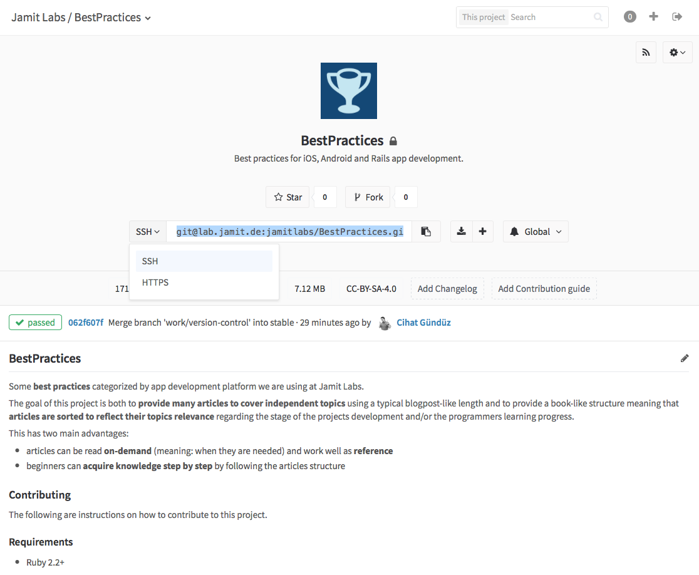
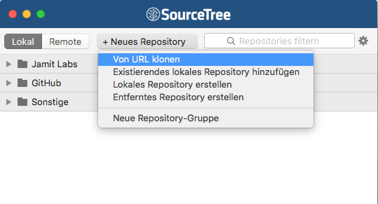
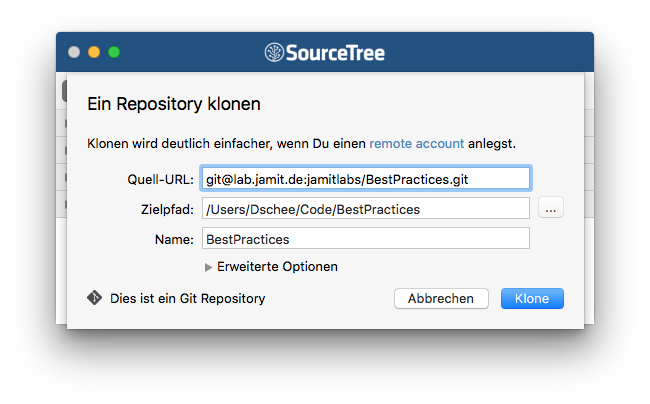

In diesem Artikel sollen alltägliche Aufgaben in Git mithilfe des Programms [SourceTree]([SourceTree](https://www.sourcetreeapp.com)) erklärt werden.

## Ersteinrichtung

TODO

## Arbeiten im Repository Browser

Der Repository Browser von SourceTree zeigt standardmäßig eine **Übersicht aller Repositories**, die man **lokal** auf dem Rechner über SourceTree eingerichtet hat. Öffnen kann man ihn am schnellsten mit der Tastenkombination `Cmd+B`. Er besitzt auch eine **"Remote"-Ansicht**, in der alle Repositories von Hosted Services aufgelistet sind, auf die man Zugriff hat und in denen man sich über die Repository Browser-Einstellungen (Settings-Icon rechts oben) angemeldet hat. Beim nachfolgend beschriebenen Arbeitsstil braucht man die Remote-Ansicht jedoch nicht, weshalb man sie komplett ignorieren kann.

Der Repository Browser erlaubt es **Repositories beliebig zu gruppieren**, ohne dass davon die tatsächlichen Pfade der Projekte geändert werden. Nützlich ist dies etwa, um mehrere Code-Projekte zu einem zusammengehörenden Produkt zusammen zu fassen.

### Erstellen eines neuen Respositories

Verzeichnisse, die von Git versioniert werden nennt man **Repositories**. Möchte man Git in einem neuen Projekt verwenden, so muss man aus dem Projektverzeichnis ein Respository machen. Dies übernimmt meist schon die Entwicklungsumgebung (z.B. Xcode oder Android Studio) biem Anlegen eines Projektes, aber nachfolgend sei kurz die manuelle Einrichtung in SourceTree geschildert:

Klicke im Repository Browser auf den Button "+ Neues Repository" und wähle "Lokales Repository erstellen". Trage nun als Zielpfad das Verzeichnis ein, in welchem das Repository angelegt werden soll, vergebe einen Namen und klicke auf "Erstellen". Der Haken ist bei "Erstelle auch ein Remote Repository" standardmäßig nicht gesetzt und der Typ steht standardmäßig auf "Git", was beides so bleiben sollte. Schon ist das neue Repository angelegt.

*Im Dialog zum Erstellen eines neuen Repositorys trägt man Zielpfad und Name ein.*

### Ein bestehendes Respository verwenden

Soll man mit einem bestehenden Respository arbeiten, so erhält man in der Regel eine Einladung für den Zugriff auf das Projekt auf einem Hosted Service (z.B. github.com, gitlab.com). Diese Services bieten zwar die Möglichkeit an, den Code etwa als ZIP-Datei herunter zu laden, jedoch ist dies nicht zu empfehlen. Stattdessen sollte man Ausschau halten nach dem "SSH" bzw. "HTTPS" Pfad.

*Möglichkeiten ein Repository von einem Hosted Service auszuschechen.*

Nun markiert und kopiert man entweder den SSH oder den HTTPS Pfad mittels `Cmd+C`, öffnet SourceTree, bringt den Respository Browser mit `Cmd+B` in den Vordergrund und wählt oben unter "+ Neues Repository" den Eintrag "Von URL klonen".

*Im Repository Browser können neue Repositories hinzugefügt werden.*

Es erscheint ein Dialog, in dem man den kopierten Pfad mittels `Cmd+V` einfügt, den Zielpfad auswählt, in den die Projektdateien des Projekts heruntergeladen werden sollen und definiert zusätzlich einen Anzeigenamen innerhalb des Repository Browsers.

*Beim Klonen kann der Zielpfad und der Anzeigename im Repository Browser festgelegt werden.*

Klickt man nun auf den Button "Klone" beginnt der Prozess, der den aktuellen Stand des Repositories vom Hosted Service herunterlädt – kurz das Repository wird **ausgecheckt***.

#### SSH oder HTTPS?

Grundsätzlich ist es einfacher per HTTPS auszuchecken, da Open Source Repositories dann gänzlich ohne Einrichtung funktionieren und für private Repositories lediglich die Login-Daten abgefragt werden. Daher sei für den Anfang HTTPS empfohlen.

Langfristig kann es jedoch auch Sinn machen auf SSH umzusteigen, da hier die Authentifizierung über ein Public-Key-Verfahren geschieht. Hierzu muss lokal auf dem Rechner eine Kombination aus Private- und Public-Keys generiert werden (falls nicht schon vorhanden), der Public-Key muss anschließend auf dem Hosted Service eingetragen werden, wodurch der Rechner für alle künftigen Projekte (durch den Private-Key) automatisch authentifiziert ist. Zur Einrichtung gibt es viele Anleitungen, zum Beispiel hier jeweils eine für [GitHub](https://help.github.com/articles/generating-an-ssh-key/) und eine für [GitLab](http://doc.gitlab.com/ce/ssh/README.html).

## Arbeiten in der Projektansicht

TODO: Schreibe Erklärungstext

*Die History-Ansicht eines Projekts zeigt im Hauptbereich die Liste der vergangenen Commits, sowie die aktuellen noch nicht committeten Änderungen an.*

*Die Änderungen-Ansicht zeigt die aktuellen Dateiänderungen im Projekt an und erlaubt sowohl das Vormerken von Dateien als auch das Eintragen einer Commit Message.*
